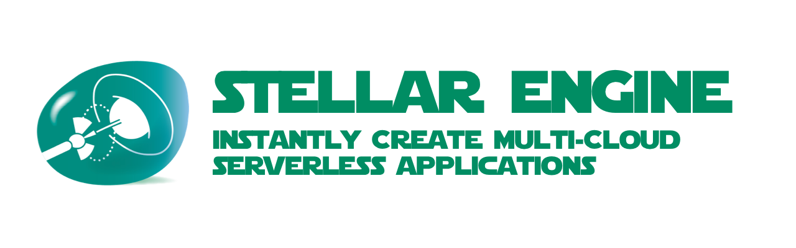

# stellarengine



> **THIS PROJECT IS STILL IN THE DESIGN PHASE**
>
> IDEAS & CONTRIBUTIONS ARE WELCOME
>
> An [Open Source Universe](https://github.com/intellibus/approach) Project

---

## Contents

- [stellarengine](#stellarengine)
  - [Contents](#contents)
  - [Features ✨](#features-)
  - [Install 🛠](#install-)
  - [Usage 🔭](#usage-)
  - [Documentation 🛰](#documentation-)
  - [Contributing 🌎](#contributing-)
  - [License ⚖️](#license-️)

## Features ✨

- Instantly Setup a Solar System Project `Planned`
- Choose Default Adapters `Planned`
- Typescript Support `Planned`

## Install 🛠

```sh
npm install -g stellarengine
```

## Usage 🔭

Read more about the [Design](https://github.com/intellibus/stellarengine/blob/main/DESIGN.md) behind `stellarengine` here.

```sh
$ stellarengine init my-project-name

Congrats! Created your Multi-Cloud App in ./my-project-name
```

## Documentation 🛰

`stellarengine` *is under active development, documentation will be added once an initial release is ready.*

## Contributing 🌎

We would love for you to contribute your ideas, code, & fixes to `stellarengine`.

We encourage everyone to read our [Design Document](https://github.com/intellibus/stellarengine/blob/main/DESIGN.md) to learn more about the thought process behind stellarengine.

Also check out the [rewards](https://github.com/intellibus/approach/blob/main/REWARDS.md) offered for contributing to the [Open Source Universe](https://github.com/intellibus/approach).

## License ⚖️

MIT
